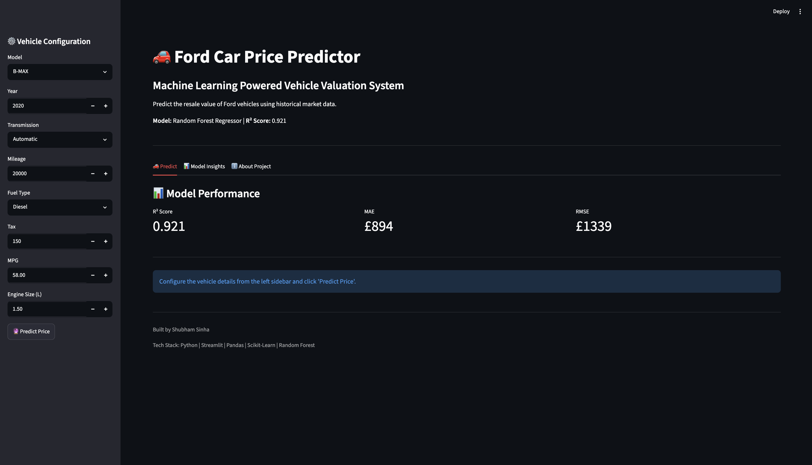
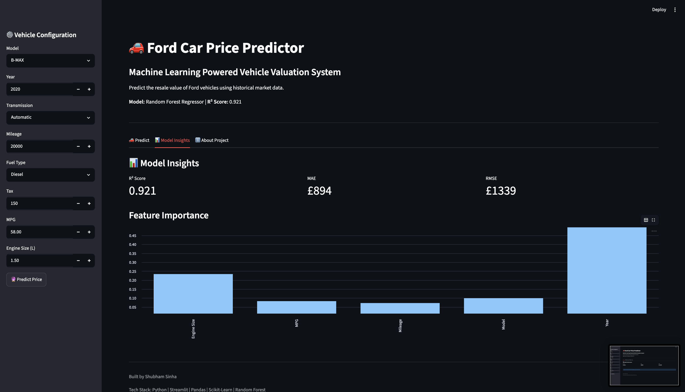
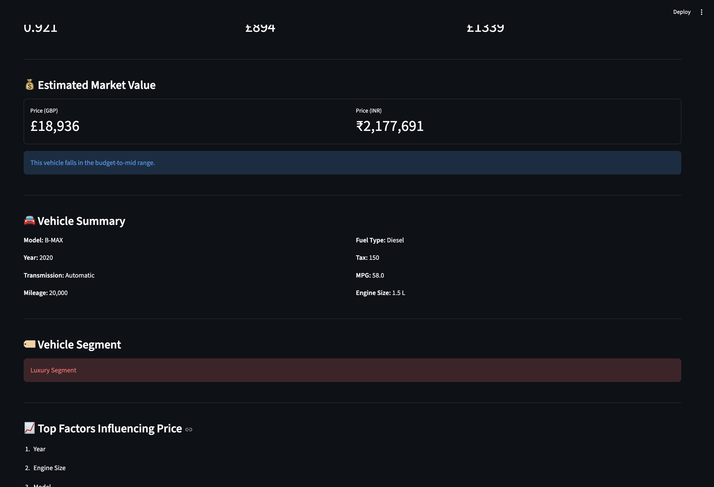

# 🚗 Ford Car Price Predictor

A Machine Learning-powered web application that predicts the resale value of Ford vehicles using historical vehicle data and a Random Forest Regressor.


---

## 📌 Project Overview

This project leverages Machine Learning techniques to estimate the market value of Ford vehicles based on various vehicle attributes.

The application provides an interactive Streamlit-based interface where users can input vehicle specifications and receive instant price predictions.

### ✨ Key Features

* 🚗 Ford vehicle price prediction
* 📊 Interactive Streamlit dashboard
* 🤖 Random Forest Regressor model
* 📈 Feature importance analysis
* 💷 Price prediction in GBP
* 🇮🇳 Price conversion to INR
* 📋 Vehicle summary and market segment classification

---

## 📂 Dataset

**Dataset:** Ford Car Price Prediction Dataset

### Dataset Statistics

```

| Metric          | Value  |
| --------------- | ------ |
| Records         | 17,966 |
| Features        | 8      |
| Target Variable | Price  |

```

### Features Used

* Model
* Year
* Transmission
* Mileage
* Fuel Type
* Tax
* MPG
* Engine Size

---

## 🛠 Machine Learning Pipeline

### Data Preprocessing

✔️ One-Hot Encoding

✔️ Standard Scaling

✔️ Train-Test Split

### Models Evaluated

```

| Model                   | R² Score |
| ----------------------- | -------- |
| Linear Regression       | 0.84     |
| Decision Tree Regressor | 0.88     |
| Random Forest Regressor | 0.92     |

```

### Final Model Selection

🏆 **Random Forest Regressor**

Selected based on superior predictive performance.

---

## 📈 Model Performance

```

| Metric   | Score |
| -------- | ----- |
| R² Score | 0.921 |
| MAE      | £894  |
| RMSE     | £1339 |

```

---

## 🔍 Feature Importance

The model identified the following factors as the most influential for determining vehicle price:

```

| Rank | Feature     |
| ---- | ----------- |
| 1    | Year        |
| 2    | Engine Size |
| 3    | Model       |
| 4    | MPG         |
| 5    | Mileage     |

---
```

## 🖼 Project Screenshots

### 🚗 Application Interface

```markdown
images/ui.png
```



---

### 📈 Feature Importance Analysis

```markdown
images/feature_importance.png
```



---

### 💰 Price Prediction Example

```markdown
images/prediction.png
```



---

## 🏗 Project Structure

```text
ford-car-price-predictor/
│
├── app.py
├── ford_price_model.pkl
├── scaler.pkl
├── model_columns.pkl
│
├── data/
│   └── ford.csv
│
├── notebooks/
│   └── Ford_Car_Price_Prediction.ipynb
│
├── images/
│   ├── ui.png
│   ├── feature_importance.png
│   └── prediction.png
│
├── requirements.txt
├── README.md
└── .gitignore
```

---

## 🚀 Installation

### Clone Repository

```bash
git clone https://github.com/yourusername/ford-car-price-predictor.git
```

### Navigate to Project

```bash
cd ford-car-price-predictor
```

### Install Dependencies

```bash
pip install -r requirements.txt
```

### Run Application

```bash
streamlit run app.py
```

---

## 💻 Technology Stack

* Python
* Pandas
* NumPy
* Scikit-Learn
* Matplotlib
* Streamlit
* Pickle

---

## 🎯 Future Enhancements

* Batch CSV Predictions
* PDF Report Generation
* Cloud Deployment
* Advanced Hyperparameter Tuning
* Additional Regression Models

---

## 👨‍💻 Author

**Shubham Sinha**

AI Engineer

---

## ⭐ Support

If you found this project useful, consider giving it a ⭐ on GitHub.
